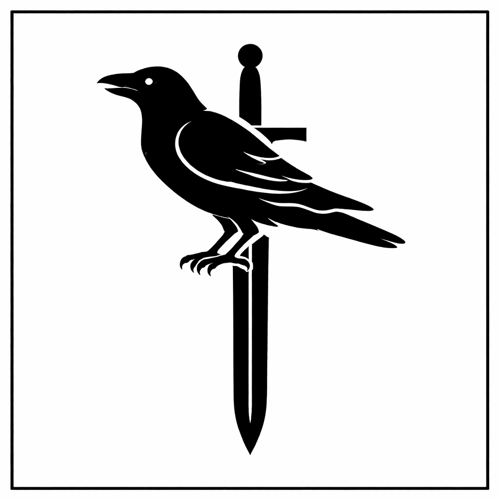

## **İmparatorluk Soylu Aileleri**

### **Florentina Soylu Aileleri**

- **Florentina  
  > **

- **Corvus  
  > **

- **De Santics  
  > **

- **La Cruix  
  > **

- **Strazni  
  > **

- **Visconty  
  > **

- **Kellen  
  > **

- **Arsivanus  
  > **

### **Venture Soylu Aileleri**

- **Venture  
  > **

- **Von Zarovich  
  > **

- **Rosalin  
  > **

- **Goldenteeth  
  > **

- **Ispwich  
  > **

- **Blackship  
  > **

### **Serenquill Soylu Aileleri**

- **Serenquill  
  > **

- **Silverthorn  
  > **

- **Mac Alister  
  > **

- **O’Connor  
  > **

- **Nightvale  
  > **

- **Ashborne  
  > **

### **Aquamere Soylu Aileleri**

- **Aquamere  
  > **

- **Blackfish  
  > **

- **Harborly  
  > **

- **Dos Valen**

- 

- **Del Valle  
  > **

### **Arcan’s Gate Soylu Aileleri**

- **Archantus  
  > **

- **Mystra  
  > **

- **Lombliver  
  > **

- **Annexila  
  > **

- **Von Draken  
  > **

- **La Seraphine  
  > **

### **Greenhall Soylu Aileleri**

- **Greenhall  
  > **

- **Frontier  
  > **

- **Slezk  
  > **

**Florentina  
**Florentina Hanedanı, imparatorluğun tartışmasız merkezidir; mutlak otorite onların elindedir ve şehirdeki diğer soylu aileler gerçek bir güç odağı olmaktan ziyade saraya yakınlıkları sayesinde varlık gösterir. Hanedan tarihi darbelerle, ihanetlerle ve saray içi mücadelelerle yoğrulmuştur; bu nedenle soyun her üyesi küçük yaştan itibaren siyaset, strateji ve iktidar dengesi üzerine yetiştirilir. Tahta çıkan kişi yalnızca kan bağıyla değil, zekâsı, iradesi ve gücüyle öne çıkar. Bu sert seçilim kültürü sayesinde Florentina soyu hem dayanıklı hem de son derece hesapçı bir karakter kazanmıştır.

Yeryüzü Tapınağı ile olan bağ ise saf bir kutsallıktan ziyade karşılıklı çıkar ortaklığına dayanır. Tapınak hanedana ilahi meşruiyet kazandırır; hanedan da tapınağı imparatorluk düzeninin merkezine yerleştirerek gücünü pekiştirir. Ancak bu bağlılık mutlak bir inançtan çok dengeli bir ittifaktır; farklı bir kral tapınağa bu ölçüde yaslanmayabilir, farklı bir dini yapı da krala bu kadar güçlü bir itaat öğretisi üretmeyebilir. İmparatorun gücü yalnızca tapınaktan gelmez; Archantus Büyücü Okulu, dini bir sadakatten ziyade Archantus’un mirası üzerinden imparatorluğa bağlıdır ve bu da hanedanın entelektüel ve büyüsel dayanaklarından biridir. Diğer lordlar ise kimi zaman çıkarları, kimi zaman korkuları nedeniyle merkeze bağlı kalır; böylece Florentina’da düzen, inanç, büyü ve siyasal hesap arasında kurulmuş hassas ama sağlam bir dengeyle ayakta durur.

Florentina ailesinin üyeleri kendilerini sıradan yöneticiler değil, seçilmiş muhafızlar olarak görürler. Onlara göre düzenin kaynağı önce soyun saflığı ve devamlılığıdır; ardından imparatorluğun bekası gelir ve ancak üçüncü sırada halk yer alır. Bu hiyerarşi acımasızlık değil, bir zorunluluk olarak öğretilir: Eğer soy zayıflarsa imparatorluk çöker, imparatorluk çökerse halk kaosa sürüklenir. Bu yüzden Florentina kanının, yanlışlardan arınmış ve doğru yolu görmüş bir rehberlik taşıdığına inanırlar. Yeryüzünü kötülükten koruyacak, insanları karanlıktan çıkaracak olanın sıradan iradeler değil, sınanmış ve seçilmiş bir hanedan olduğu düşüncesi aile kültürünün temelidir; kendilerini ışık olarak görürler, fakat o ışığın bedelinin ağır olduğunu da bilirler.

**Corvus  
**Corvus ailesi, Florentina Hanedanı’na bağlılığını açıkça ilan eden ilk ailedir ve kökenleri soyluluk değil, hizmettir. Başlangıçta sıradan fakat yetenekli bir haneyken, imparatorluk uğruna gösterdikleri üstün fedakârlık ve savaş meydanlarındaki kararlılıkları sayesinde soyluluk unvanı kendilerine bahşedilmiştir. Corvuslar hiçbir zaman ödül ya da makam beklentisiyle hareket etmemiş; tehlike belirdiğinde en öne atılan, imparatorluk için kalkan olan taraf olmuşlardır. Bu yüzden aile geleneği büyük ölçüde askerlik üzerine kuruludur. Orduda yüksek rütbeler, sınır kaleleri ve kritik görevler sıklıkla onların elindedir. Ancak Corvus yalnızca savaşçı bir aile değildir; halkla temas hâlinde olan nadir soylulardandır. Alt sınıfların sıkıntılarını bilen, cephede askerle aynı sofrayı paylaşan ve gerektiğinde imparatora halkın nabzını aktaran bir yapıları vardır. Bu özellikleri sayesinde birçok Corvus üyesi imparatora askerî ve stratejik danışmanlık yapmış, savaş kadar siyaset konusunda da güven kazanmıştır. Sadakatleri tartışılmazdır; fakat bu sadakat kör bir bağlılık değil, Florentina soyunun düzeni temsil ettiğine duydukları bilinçli inançtan doğar.

**De Santis  
**De Santis ailesi, La Cruix ile birlikte imparatora ilk biat eden eski ve köklü soylu ailelerdendir. Soyları Florentina Hanedanı’ndan önceye dayanır; bu yüzden taşıdıkları asalet duygusu güçlüdür ve zaman zaman bu durum belirgin bir kibir olarak dışa vurur. Ancak De Santisler için sadakat romantik bir bağlılıktan ziyade bilinçli bir tercihtir: Kendi çıkarlarını gözetirler, fakat uzun vadeli çıkarlarının imparatorluğun istikrarıyla örtüştüğünü bilirler. Bu nedenle özellikle ticaret düzeni, vergi sistemi ve kanunların kurumsallaşması konusunda imparatorluğa büyük katkı sağlamışlardır. Aile üyeleri çoğunlukla ticaret ağları, hukuk meclisleri ve mali düzenlemelerle ilgilenir; birçok şehirle bağlantıları vardır ve ekonomik dengeleri ustalıkla yönetirler. İmparatorluğun ticari damarları büyük ölçüde onların planlamasıyla işler. Gururlu, mesafeli ve hesapçı bir yapıları olsa da bu kibir hiçbir zaman görev bilincinin önüne geçmez; De Santisler için güç, daima düzen içinde ve kurallar çerçevesinde anlam kazanır.

**La Cruix  
**La Cruix ailesi, De Santis ile birlikte imparatora ilk biat eden en eski ve köklü soylu hanelerden biridir. Dışarıdan bakıldığında merhametli, kültürlü ve zarif bir aile izlenimi verirler; ancak bu yumuşak görüntünün ardında derin ve sabırlı bir oyun kuruculuk vardır. Uzun yıllar boyunca imparatorluğun eğitim, sanat ve düşünsel yapılanmasında baş danışmanlık görevini üstlenmiş, akademilerden saray mürebbiyelerine kadar pek çok alanda belirleyici olmuşlardır. Serenquill’in imparatorluğa bağlanmasına kadar kültürel yönlendirme büyük ölçüde onların elindeydi. Serenquill’in yükselişiyle birlikte etkileri görece azalmış olsa da La Cruix ailesi asla sıradanlaşmamıştır. Üyeleri son derece iyi eğitimlidir; hukuk, diplomasi, edebiyat ve saray protokolü konusunda derin bir birikime sahiptirler. Bu nedenle imparatorluk bünyesinde herhangi bir idari ya da entelektüel görevi rahatlıkla üstlenebilirler. Güçleri artık açık bir hâkimiyetten ziyade incelikli etki ve doğru zamanda doğru yerde olma becerisine dayanır.

**Strazni  
**Strazni ailesi, imparatorluk düzeninin en sert ve en tavizsiz yüzünü temsil eder. Katı kuralcılıklarıyla bilinirler; küçük bir heretiklik kırıntısını ortadan kaldırmak için bütün bir ormanı yakmaktan çekinmezler. Engizisyonun temellerini atan hanedan olarak, düzeni koruma görevini inançtan çok disiplin ve korku üzerinden tanımlarlar. Onlar için sapma, büyümeden bastırılması gereken bir hastalıktır. Bu nedenle yasama, yürütme, yargı ve ordu kademelerinde yoğun şekilde yer alır; kanunları yazar, uygular ve gerektiğinde bizzat infaz ederler. Diğer soylu aileler tarafından sertlikleri ve hoşgörüsüzlükleri nedeniyle sevilmezler; ancak imparatorluk, özellikle kriz zamanlarında, Strazni gibi bir güce ihtiyaç duyar. Florentina Hanedanı’na üst derecede bağlıdı k rlar ve bu bağlılık neredeyse mutlak sadakat seviyesindedir. Onlardan daha bağlı oldukları tek yapı Yeryüzü Tapınağı’dır; fakat bu bağlılık dahi saf bir iman değil, düzenin kutsallığına duyulan inançtan doğar. Hatta bazı noktalarda tapınağın kendisinden bile daha katı olabilirler. Strazni’nin yobazlığı dinden çok düzenin korunmasına dayanır; onlar için merhamet bir lüks, istikrar ise vazgeçilmez bir zorunluluktur.

**Visconty  
**Visconty ailesi, diğer soylu hanelere kıyasla daha küçük ve daha mütevazı bir güç yapısına sahip olsa da imparatora olan sarsılmaz bağlılıklarıyla öne çıkar. Kendilerine verilen hiçbir görevi sorgulamaz, küçümsemez ya da reddetmezler; hatta diğer ailelerin asil bulmayıp geri çevireceği görevleri dahi tereddüt etmeden üstlenirler. Bu tavırları kimi zaman onları hafife alınır bir konuma düşürse de uzun vadede güvenilirlikleri sayesinde saray içinde istikrarlı bir yer edinmelerini sağlamıştır. Sayıca ve ekonomik olarak büyük olmasalar da sorumluluk üstlendikçe görünürlükleri artar ve her görev onları bir basamak daha yukarı taşır. Viscontyler aynı zamanda neşeli ve halkla iç içe bir aile olarak bilinir. Şehirde törenlerde, festivallerde ve kamusal etkinliklerde sıkça görülürler; bu yönleriyle diğer soyluların mesafeli tavrından ayrılırlar. “Şanslı” bir aile olduklarına dair yaygın bir inanç vardır; zor görevlerden zarar görmeden çıkmaları, doğru zamanda doğru yerde olmaları bu söylentiyi besler. Belki de güçleri tam da buradan gelir: kibirden uzak, çalışkan ve güvenilir bir hanedan olarak, küçük adımlarla ama istikrarlı biçimde yükselmeyi bilirler.

**Kellen  
**Kellen ailesi, Florentina’da “güç” sahibi olmaktan çok güce en doğru açıyla duran aile olarak bilinir. Ne Corvus gibi fedakârlıkla yükselmişlerdir, ne De Santis gibi sistemi omuzlarında taşırlar; Kellen’ler daha çok akışın yönünü okur, rüzgârın nereden eseceğini sezerek doğru anda doğru cümlenin altına imza atarlar. Bu yüzden sarayda “yalaka” diye anıldıkları da olur; fakat bu, ucuz bir yaranma değil, hesaplı bir nezaket ve gösterişli bir uyum sanatıdır. Onlar övmeyi bilir, alkışı zamanında verir, bir sözün hangi salonda nasıl yankılanacağını herkesten önce hesap ederler. Kellen ailesinin asıl gücü, sosyal sermaye ve gösteri yönetimidir: törenleri kusursuz organize eder, yeni atanan valiyi bir gecede efsaneye çevirir, bir skandalı zarif bir bağış gecesine dönüştürürler. Şehir loncalarıyla, küçük bürokratlarla, saray hizmetlileriyle ve hatta sanat çevreleriyle bağ kurmaktan çekinmezler; “aşağı” görülen ilişkileri bile ciddiye alır, sonra o ağın meyvesini toplarlar. İmparatora sadakatleri samimidir ama aynı zamanda fırsatçıdır: İmparatorun gözüne girmek onlar için güvenliktir, yükselme ihtimalidir, aileyi hayatta tutan stratejidir. Bu nedenle herkesin söylemeye cesaret edemediği şeyleri söylemezler; ama herkesin söylemesi gerekeni ilk onlar söyler. Şov düşkünlükleri burada devreye girer: Kellen’ler iktidarı tutmaz, iktidarın ışığında parlamayı seçer—ve çoğu zaman bunu kimseye çaktırmadan, gayet akıllıca yaparlar.

**Arsivanus  
**Arsivanus ailesi, kökleri eski büyü hanedanlarına dayanan ve kadim gelenekler taşıyan bir soydur; aslen Arcan’s Gate’te yaşamış, oradaki büyücü çevrelerinin parçası olmuşlardır ancak şehirde patlak veren bir isyan sırasında taraf tutmamaları onları hem güvensiz hem de yalnız bir konuma sürüklemiş ve sonunda Arcan’s Gate’teki varlıklarının sonunu getirmiştir. Yok edilmek yerine başkente taşınmaları tesadüf değil, İmparator’a gösterdikleri tam sadakatin bir karşılığıdır; Florentina Hanedanı onların tarafsızlığını zayıflık değil merkeze bağlılık olarak yorumlamış ve bu potansiyeli yanında tutmayı tercih etmiştir. Başkentte ilk başta Arcan’s Gate’li büyücü aileler tarafından küçümsenseler de sarayın imkânlarına erişimleri ve imparatorluğun güç mekanizmalarıyla kurdukları bağlar onları hızla rekabet edebilir bir konuma taşımıştır; Arsivanuslar büyüyü yalnızca kulelere kapatılmış bir ayrıcalık olarak değil, hukuktan eğitime, askerî stratejiden şehir planlamasına kadar devlet aklının doğal uzantısı olarak görür ve imparatorluğun büyüsel danışmanlığını yürütürken büyüyü merkezi düzenin bir aracına dönüştürmeyi savunurlar. Bu yaklaşım, onları hem tehlikeli hem de vazgeçilmez kılar.

**Venture  
**Venture ailesi, imparatorluktaki en büyük ekonomik güçlerden biridir; hatta çoğu kişi için imparatorluk hazinesinden sonra en güçlü mali damar onlardadır. Bankacılık, kredi sistemleri ve yatırım ağları konusunda ustadırlar; paradan para kazanmayı yalnızca bir yetenek değil, bir sanat olarak görürler. Kibirden çok akla güvenir, kaynakları en verimli şekilde kullanarak büyümeyi tercih ederler. İmparatora sadakatleri rasyoneldir: İstikrarın olduğu yerde kâr vardır. Florentina Hanedanı’nın onları Venture şehrinin başına getirmesi bir lütuf değil, güvenin sonucudur. Soğukkanlı, hesapçı ve güçlüdürler; güçlerini gösterişle değil, rakamlarla ispat ederler.

**Von Zarovich  
**Von Zarovichler daha içe kapanık, daha bireysel ve daha gizemli bir yapıya sahiptir. Büyülü eşya ticaretinde ustadırlar; elf ve cüce diyarlarıyla kurdukları özel bağlar onları farklı bir konuma taşır. Zengindirler ancak servetleri gürültülü değildir; nadir, değerli ve seçkin ürünlerle ilgilenirler. Aile içinde sır saklamak bir erdem sayılır. Diğer soyluların açık rekabetine pek girmezler; sessizce büyür, sessizce güç kazanırlar.

**Rosalin  
**Rosalin ailesi zarafet, elitlik ve incelikle anılır. Sanat, küçük ama yüksek değerli ürün ticareti ve özellikle üzüm ile şarap üretimi onların uzmanlık alanıdır. Sayıca az ama etkili bir ailedirler; asaletlerini kalabalıkla değil kaliteyle ölçerler. Halkla aralarına belirgin bir mesafe koyarlar; bu mesafe hem saygınlık hem de üstünlük hissi yaratır. Goldenteeth ailesiyle süregelen rekabetleri hırslarını besler; Rosalin için ticaret yalnızca kazanç değil, prestij mücadelesidir.

**Goldenteeth  
**Goldenteeth ailesi kalabalık, gürültülü ve gösterişli bir hanedir. Demir, odun ve benzeri daha ucuz ama bol miktarda tüketilen malların ticaretiyle büyük bir servet edinmişlerdir. Halkla daha iç içe olmaları onları tabanda güçlü kılar; ancak diğer soylular tarafından zaman zaman küçümsenirler. Bu küçümseme kibirlerini ve rekabet duygularını besler. Rosalin ile aralarındaki çekişme yalnızca ticari değil, sosyal bir mücadeledir. Zenginlikleri tartışılmazdır; sayıları ve ağları sayesinde ayakta kalırlar.

**Ispwich  
**Ispwich ailesi imparatora ve Venture hanedanına sadakatiyle bilinir. Şehir yönetimi ve bürokrasi konusunda akılcı, dengeli ve istikrarlı bir yapıdadırlar. Venture şehrindeki dengeyi sağlayan kilit ailelerden biridir; kriz zamanlarında panik yerine hesap yaparlar. Diğer aileler kadar zengin olmasalar da yönetim becerileri sayesinde saygınlık kazanırlar. Güçleri servetten değil, düzeni sürdürebilme yeteneklerinden gelir.

**Blackship**Blackship ailesi köken olarak eski korsanlara dayanır; imparatorluğa yaptıkları büyük bir hizmet sonucunda soyluluk kazanmışlardır. Gemicilikte ustadırlar ve denizle olan bağları hâlâ güçlüdür; ancak ticaret konusunda Rosalin ya da Goldenteeth kadar incelikli değillerdir. Soylu geleneklere tam anlamıyla alışmış sayılmazlar; bu durum hem onları dışarıdan gelen gibi gösterir hem de daha özgür kılar. İmparatora bağlıdırlar, fakat ilk büyük hizmetlerinden sonra hep “sonradan gelen” olarak görülmüşlerdir. Yine de işler zorlaştığında, özellikle deniz ve savaş söz konusu olduğunda, sahneye çıkar ve görevlerini eksiksiz yerine getirirler.

**Serenquill  
**Bu aile, Florentina şehri kurulmadan önce de burada yönetici konumundaydı; eskiden bu toprakların krallarıydılar. Florentina büyük bir ordu ve sarsılmaz bir kararlılıkla kapılarına dayandığında şehri barış yoluyla teslim ettiler ve bunun karşılığında Serenquill’in yönetici lordluğu kendilerine bırakıldı. Kadim hanedanın birinci önceliği, imparatorluğun en kuzeyinde ve coğrafya bakımından en tehlikeli konumda bulunan Serenquill’i barış ve huzur içinde yönetmektir. Bu amaçla caydırıcı cezalar uygularlar; üstelik bu cezalar soylu ya da köylü ayrımı gözetmeksizin işletildiği için diğer aileler onlara saygı duysa da sevgi beslemez. Aile, kraliyet hanedanıyla birçok kez akrabalık bağı kurmuştur. Üyeleri yüksek eğitimlidir, pek çok dil bilirler ve Serenquill’in kütüphanelerini kendi hazinelerinin en kıymetlisi sayarlar.

**Silverthorn  
**Serenquill hanesinden ayrılan bir soy olarak Silverthornlar, imparatorluktaki en kuzeyli geleneklere en yakın yaşayan ailelerdendir. Bu uyum, şehir dışındaki kırsal kasabalarla ilgilenmelerinden ve o sert coğrafyada ancak bu şekilde ayakta kalabilmelerinden doğmuştur. İmparatora bağlılıkları, esasen Serenquill’e duydukları bağlılıktan beslenir. Savaşçıların, avcıların ve maceracıların bol olduğu bu aile, şehir halkı içinde belirgin bir ağırlık taşımaktan ziyade kırsal halk tarafından büyük ölçüde sevilir.

**Mac Alister  
**Şehir fethedildikten sonra buraya yerleştirilen Mac Alisterlar, Serenquill hanesinden sonra şehirdeki en nüfuzlu aile konumuna yükselmiştir. Öyle ki imparatorlukla en fazla akrabalık bağı bulunan soylar arasında ilk sırada anılırlar. Serenquill’de ticaretin büyük kısmını onlar üstlenir; özellikle mürekkep ticaretinde yüksek paya sahiptirler. Şehirdeki diğer ailelerin aksine bağlılıkları önce imparatora, sonra Serenquill’e olduğundan bu tutumları nedeniyle her zaman sevilmezler.

**O’Connor  
**Diğer ailelere kıyasla gücünü büyük ölçüde yitirmiş olan O’Connorlar, geçmişte Aux İmparatorluğu safında Florentina’ya karşı savaşmışlardır. Zaman içinde Aux’tan kaçmak zorunda kalıp Florentina İmparatorluğu’na sığınmış ve Serenquill’e yerleşmişlerdir. Bugünlerde ise eski şan ve şöhretlerini geri kazanmak için sabırla çalışır, kaybettikleri itibarı adım adım yeniden inşa etmeye uğraşırlar.

**Nightvale  
**Silverthornlar Serenquill’in kırsaldaki koluysa, Nightvale hanesi de bu soyun şehir içindeki kolu sayılır. Şehrin savunması çoğu zaman bu ailenin omuzlarındadır. Bağlılıkları önce Serenquill’e, sonra imparatora uzanır. Sahip oldukları gece bahçeleriyle meşhurdurlar; bu bahçeler, şehrin sert ikliminde bile kendine has bir ihtişam taşır. Bazıları aileden kimselerin yasaklı büyülerle ilgilendiğini fısıldar, fakat Serenquill’de her ailenin ardından mutlaka bir dedikodu sürüklenir.

**Ashborne  
**Tarih yazıcılığında Arcan’s Gate ile yarışacak kadar güçlü bir geleneğe sahip, bilgin bir ailedir. Bilgelikleri sayesinde imparatorluğun pek çok noktasında bürokratik görevler üstlenirler. Her ne kadar imparatorluğa yayılmış olsalar da her Ashborne üyesi önce Ashborne’un, sonra Serenquill’in çıkarları için çalışır. İmparatorluğa fayda sağlamayı önemserler; ta ki bu fayda Serenquill’in menfaatleriyle çatışana dek.

**Archantus**  
Archantus hanesi, isimlerini aldıkları Tanrı Arkan’ın soyundan geldiklerine inanılan, kentin ve imparatorluğun en kutsal, en kudretli büyücü ailelerinden biridir. Kanlarında sihrin en saf ve güçlü hâli akar; bu yüzden büyü, onlar için öğrenilen bir zanaattan ziyade taşıdıkları ilahi bir mirastır. Şehirdeki devasa Büyücü Okulu’nun yönetimi ve hocalık kademeleri büyük ölçüde onların elindedir. Büyüyü akademik bir ciddiyetle, kurallara ve kadim geleneklere bağlı kalarak icra ederler. İmparatorluğun büyüsel entelijansiyasını oluşturan bu aile, kulelerinden tüm diyarı izler ve yüksek büyü sanatını imparatorluğun görkemiyle eş tutar.

**Mystra**  
Tıpkı Archantus gibi soylarında yoğun bir büyüsel güç barındıran Mystra ailesi, büyüyü kitaplardan okuyarak öğrenen "büyücülerden" (wizard) ziyade, bu gücü doğuştan içgüdüsel olarak kullanan "efsunculardan" (sorcerer) oluşur. Disiplinli ve kuralcı okul hayatı onlara göre değildir. Mystralar, büyücülerin daha fazla hakka, daha geniş bir hareket alanına ve özgürlüğe sahip olması gerektiğini açıkça savunur. Kulelere kapanmak yerine diyarı karış karış gezen, rüzgârın ve serbest sihrin peşinden giden gezgin büyücüleriyle ün salmışlardır. Bağımsız ruhları, zaman zaman kuralcı Archantus hanesiyle ters düşmelerine neden olur.

**Lombliver**  
Lombliver ailesi, Arcan’s Gate gibi sihrin başkentinde yaşamasına rağmen büyü pratiklerinden bilinçli bir şekilde uzak duran, bunun yerine Archantus soyuna dini bir huşu ile tapan geleneksel bir hanedir. Onların felsefesine göre, Archantus ailesi fildişi kulelerinde büyücülük oynarken, şehrin lojistik, güvenlik ve asayiş gibi gerçek dünyevi sorunlarını çözmek Lombliver’ların görevidir. İmparatora ölümüne bağlıdırlar ve başkentin bu gizemli şehirdeki asıl gözü kulağı konumundadırlar. Hırsları ve sadakatleri o kadar yüksektir ki, bazen diğer aileleri hainlikle suçlarken sınırları aşabilirler. Yine de, büyücülerin egolarıyla şişmiş bu şehirde, ayakları yere basan bir idari güç olarak Lombliver ailesi imparatorluk için vazgeçilmezdir.

**Annexila**  
Bu hane için büyü, kibrin ya da gizemli araştırmaların bir aracı değil; doğrudan halka, topluma ve devlete hizmet etmesi gereken bir "iş aletidir." Kudretli büyücülerin dünyadan izole bir şekilde güç fantezileri kurmasına şiddetle karşı çıkarlar. Temel felsefeleri "az büyü, çok iş" üzerine kuruludur. Tarımı kolaylaştıran, hastaları iyileştiren ya da şehir altyapısını güçlendiren pratik sihirleri tercih ederler. Yönetimsel olarak Archantus ailesinin en sadık sağ kolu konumundadırlar. Şehirdeki diğer haneler onları Archantus'un "yalakaları" olarak küçümsese de, Annexila'nın tek amacı sıradan halkın yaşamını büyü yoluyla kolaylaştırmaktır.

**Von Draken**  
Aslen Aux kökenli olan Von Draken ailesi, İmparatorluk topraklarına sonradan dâhil olmuş ancak muazzam bir hızla uyum sağlamıştır. Büyü yapmaktan ziyade, büyüyle üretilmiş nadir materyallerin, sihirli eşyaların ve tılsımların tüccarlığını yaparak devasa bir servet inşa etmişlerdir. Diğer haneler onların İmparator’a ya da Arcan's Gate’e olan sadakatini her zaman sorgular; zira her kararlarının arkasında altın yatar. Aidiyetleri şüpheli olsa da, şehrin sunduğu imkânları ticari bir imparatorluğa dönüştürme konusunda diyarda onların üzerine yoktur.

**La Seraphine**  
Çok eski çağlarda Aux'taki dini baskılardan ve uyumsuzluklardan kaçarak İmparatorluğa sığınan bu aile, ilk birkaç yüzyıl boyunca farklı kültürleri ve inançları nedeniyle hep dışlanmış ve sorgulanmıştır. Ancak zamanla hayatta kalma güdüsüyle radikal bir dönüşüm geçirmiş, İmparatorluk Kilisesi'ni herkesten çok benimsemiş ve bu yeni inançta sergiledikleri yobazlıkla ün salmışlardır. Günümüzde şehirdeki diğer aileler tarafından sinsi ve fazlasıyla tehlikeli bulunurlar; ancak İmparatorluk, La Seraphine hanesini bilerek orada tutar. Çünkü güç kazanmak için rakiplerinin en ufak dini ya da yasal hatasını kollayan bu aile, Arcan's Gate’in başına buyruk büyücülerini dizginleyen mükemmel bir güvenlik sübabıdır.

**Aquamere**  
Şehre adını veren Aquamere ailesi, bu coğrafyanın en kadim sakinleridir ve Florentina Hanedanı’nın denizlerdeki mutlak hâkimiyetini kurmasına tarihi bir destek sağlamışlardır. Şehirdeki en imparatorluk yanlısı aile onlardır. Aslında kendi refahlarını büyütmekten çok, limandaki diğer başına buyruk haneleri dizginlemek, su altı halklarıyla dengeyi korumak ve Aquamere’i İmparatorluğun güvenilir bir çapası olarak tutmak için bütün mesailerini harcarlar. İhtişamlı görünürler ancak omuzlarındaki idari yük oldukça ağırdır.

**Blackfish**  
Kökleri denizlerin tekinsiz sularında terör estiren eski korsanlara dayanan Blackfish hanesi, soyluluğu bir lütuf değil, savaş meydanında kopardıkları bir hak olarak görür. Zamanında kralı mutlak bir ölümden kurtardıkları için soyluluk unvanı almışlardır; bu nedenle şehirdeki "geleneksel" soylular tarafından sürekli hor görülürler. Saray adabından uzak, ağzı bozuk ve özgürlükçüdürler. Denizin kuralsız ruhunu taşıyan bu hane, diplomasi masasından çok fırtınalı bir denizde savaşmayı tercih eder.

**Harborly**  
Blackfish ailesinin aksine Harborly hanesi, denizi bir savaş alanı değil, uçsuz bucaksız bir ticaret ve keşif rotası olarak görür. Deniz savaşından ziyade ticari filoları, usta balıkçılık teknikleri ve kusursuz haritalandırma yetenekleriyle öne çıkarlar. Ailenin her üyesi doğuştan birer maceraperest ve coğrafyacıdır. İmparatorluğun bilinmeyen kıyılara uzanan ekonomik kollarını oluşturur, limanlara akan zenginliğin lojistiğini kusursuzca sağlarlar.

**Dos Valen**  
Aquamere şehrinin denize dönük yüzünün aksine, toprağa basan ayaklarıdır. Şehri çevreleyen kasabalarda devasa tarım arazilerini yönetir, Aquamere'in erzak ve erzak güvenliğini sağlarlar. İhtiraslı deniz maceralarından uzak duran bu aile, daha çok şehrin sıkıcı ama hayati olan bürokratik işleriyle ilgilenir. Aquamere hanesinin en büyük destekçisi konumundadırlar; kâğıt işlerini, vergi toplamayı ve gıda dağıtımını yönettikleri için şehrin gerçek çarkları onların elinde döner.

**Del Valle**  
Aux’tan Aquamere’e en son göç eden soylu hanedir ve bu yüzden şehirde sürekli soru işaretleriyle takip edilirler. Kendilerini henüz tam anlamıyla kanıtlayamamışlardır; imparatorluğa büyük bir hizmet sunacakları o kritik anı sabırla beklerler. O güne dek sessiz, sorunsuz ve sadık bir görüntü çizerler. Tıp, şifa ve biyolojik bilimler konusunda diyardaki en yetkin isimlerdir; sırf bu özellikleri bile onların dışlanmasını engeller ve saraylarda dahi aranan isimler olmalarını sağlar.

### 

**Greenhall**  
Greenhall ailesi, İmparatorluk'un en yeni yöneticilerinden biri olmasına rağmen, kökenlerindeki Florentina ve Corvus akrabalığı sayesinde şüphe götürmez bir meşruiyete sahiptir. "Greenhall Projesi" olarak bilinen bu tehlikeli sınır yerleşiminin inşasını ve yönetimini üstlenerek şehre kendi isimlerini vermişlerdir. Kıyısı olmayan, ticaretin tehlikeli kırsaldan geçtiği ve yerel "yeşilderili" halkların şehir içinde yaşamasına müsaade edilen bu kaotik bölgeyi yönetmek devasa bir sınavdır. Mühendislik dehaları, askeri disiplinleri ve yöneticilik yetenekleriyle bu zorlu görevin altından kalkmaya çalışırlar. Diğer lordlardan toplanan vergilerin doğrudan bu projeye aktarılması onları diyardaki kıskançlıkların hedefi yapsa da, arkalarındaki Florentina kanı ve sarsılmaz imparatorluk sadakati, herkesi hizaya sokan yegâne kalkanlarıdır.

**Frontier**  
Aslen Başkent'ten gelen ve nesiller boyu ordunun en üst kademelerinde görev yapmış katı, kuralcı ve tavizsiz bir asker ailesidir. Greenhall şehrinin askeri belkemiğini oluşturmaları için buraya bizzat yerleştirilmişlerdir. Greenhall hanesinin yeşilderililerle kurmaya çalıştığı entegrasyon politikalarına sıcak bakmazlar; onlar için sınır demek, ötekini dışarıda tutmak demektir. Hoşgörüsüz ve sert yapılarına rağmen, şehrin vahşi doğaya ve olası saldırılara karşı hayatta kalmasını sağlayan yegâne askeri güç oldukları için kimse onların üzerine gidemez.

**Slezk**  
Daha önce Aquamere şehrinin kozmopolit yapısında tecrübe kazanmış olan Slezk ailesi, o çok kültürlü deneyimi alıp Greenhall’un bürokratik ve dini işlerini yönetmesi için buraya gönderilmiştir. Dışarıdan bakıldığında barışçıl ve hoşgörülü bir bürokrat hanesi gibi görünürler; ancak bu yumuşak yüzeyin altında katı bir misyonerlik zihniyeti yatar. Onların nihai amacı, bölgedeki yeşilderili halkları birer araç olarak kullanmak ve onları kendi köklü inançları olan "Gorg ve Morg"dan kopararak İmparatorluğun resmî dini olan "Amarath"a geçirmektir. Slezklere göre bir yeşilderilinin ruhu ancak İmparatorluğun dinine biat ettiğinde kurtulabilir; bu yüzden hoşgörüleri aslında bir asimilasyon silahıdır.
